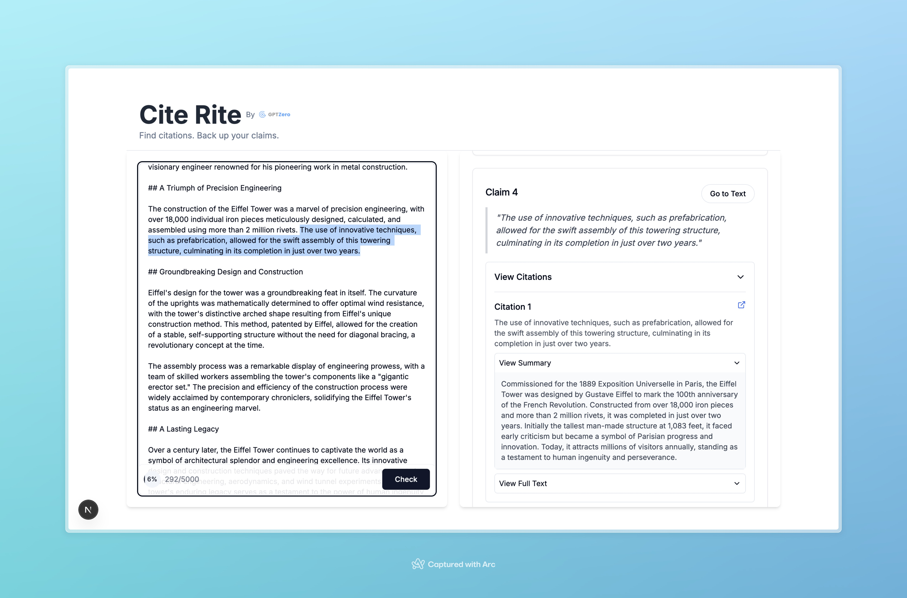

# Submission - Shaamil Karim Shaw Alem

## Key features

1. **Two-Column Layout**  
   - Left side for user input  
   - Right side for dynamically generated claim-citation results

2. **Text Input & Word Count Tracker**  
   - `Textarea` component with live word count and circular progress indicator  
   - Added Max limit of 5000 words 

3. **Claim Detection & Highlighting**  
   - On clicking "Check", given backend is called (`postSourceScan`)  
   - Highlights each detected claim in the text on button click

4. **Dynamic Claim Cards**  
   - Each claim shown in a styled `Card` with the quote, index, and "Go to Text" button  
   - Claims are clickable and scroll to the text location

5. **Citation Viewer with Expandable Sections**  
   - Citations shown in collapsible sections under each claim  
   - Each citation includes: snippet, source link, expandable summary, and full text

6. **Help Modal**  
   - Dialog explaining how to use the app, step-by-step

### Potential improvements in NOTES.md!
## Use of AI

### Key AI tools used:

- v0 - Attached a hand-drawn sketch of website along with prompt for building the styling and basic functionality.  
  
  Input:  

  Sketch:  
    

  Prompt:  
  In the attached screenshot is a sketch of what I want the frontend of the website to look like. We are developing Cite Rite, a tool that helps people see how much evidence there is for the claims found in a text, using AI, in order to help the increase the quality and transparency of the world's knowledge. In our app, users submit a piece of text, and Cite Rite will extract the testable claims in a text, find citations related to the given text, and extract the logical dependencies of the claims in the text.  
    
    **Crucial instructions** 

  In the screenshot with enhanced UI/UX, we see that the left is a text box where users can add text and at the bottom of the text bar are two fields. The left (bottom-left) field has an indication of how many words are inputted out of the maximum amount of words. There's first the circle that fills up based on the amount of words, and then to the right of that is the actual number of words written by the total amount of words allowed. At the bottom-right is a button with rounded corners that says "Check".  

  Now, the right half of the screen has the results. On the same horizontal axis as the results is a circular button with a question mark that opens a pop-up on how to use this website. Followed by which there are boxes. Each box is for each claim. On the same horizontal axis as the claim (like Claim 1), there is a goto text rounded corner button. This is followed by the actual text that is the claim, and then there is an expandable list called "View Citations." If somebody clicks on the arrow, it opens up a list much like Notion does in its UI/UX.

  After opening this list, you can see the citations all of the citations with a summary, and then another collapsible list arrow for viewing the full text. The citation one title as you can see has a logo for clicking the full link to view the link, and so that will be hyperlinked. And that's the box itself. This needs to be repeated for all of the boxes which is all of the claims.  
  
  Context:  
  User Stories
As a student who uses AI to help write essays, I'd like to quickly understand which arguments of my writing are evidence-based (e.g., have high-authority citations), and which are not.
As a subscriber to independent journalist sources, I'd like to better understand the validitiy of claims made in certain articles.  
  
  The Challenge
The frontend must be updated to clearly display the parts of the text that are claims and illustrate their relationship with the associated citations returned by the backend.  
  
  Objectives:
Display Scan Results Intuitively:
Replace the raw JSON output with a structured, interactive display of the Cite Rite scan results.
Users should intuitively understand which parts of the inputted document are logical claims, and which citations are related to each claim.
Enhance Interactivity:
Allow users to interact with a claim to view more detailed information about its citations.
Users should have the ability to get guidance on how to use the app and interpret the results.
Improve UI/UX Design:
Redesign the interface to be clean and aesthetically pleasing.
Utilize best practices
Submitted code should be readable, error-free, and utlize modern React best practices.

- ChatGPT 4.5 - Mainly for debugging errors

